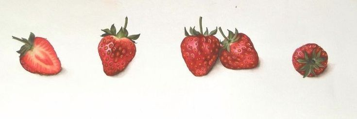

## Welcome to my portfolio page!
I'm Tomiris

I'm an engineering student at the University of Applied Sciences of Upper Austria, Linz. I am passionate about building creative solutions with technology, improving user experiences, and expanding my knowledge in software development. Currently looking for full-time, or preferably part-time work, feel free to reach out

### Skills

